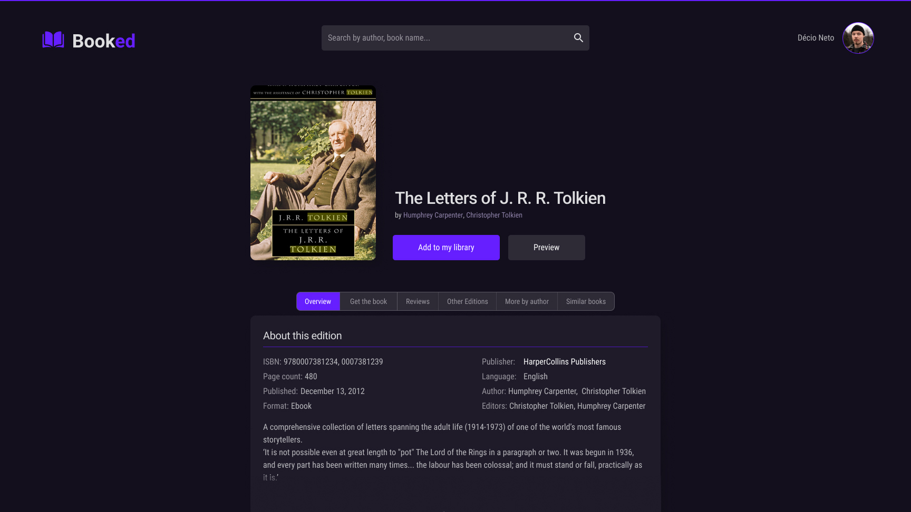

# Booked (in progress)
App for booklovers search and organize their books.

## Overview

### Test the project:

- clone or fork the repository;
- run **npm install** for the dependences;
- **npm start** to start the server and open on http://localhost:3000 in the browser.

### Users should be able to:

- Search books, authors and more;
- Save and organize your readings;
- Favorite your most liked books;
- Discover other books from those that you liked;
- Find out were they are avalable for sell;
- Chose between light and dark mode;
- Fully responsive and accessible

## My process

### Built with

- Google Books API;
- React Js;
- Typescript;
- Styled-components;
- Radix UI;
- Axios.

## Author

- Linkedin - [Décio Neto](https://www.linkedin.com/in/decioneto/) 👋